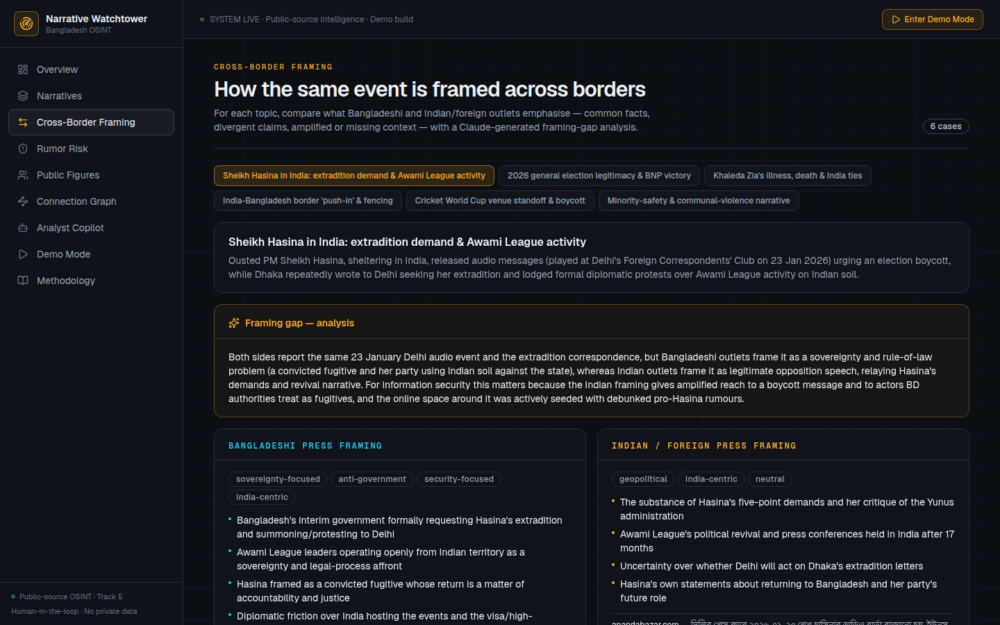

# Narrative Watchtower

Public-source narrative intelligence for Bangladesh's information security.

**Live demo:** https://narrative-watchtower.vercel.app (no login required)

Built for the SciBlitz AI Challenge 2026 (IEEE Student Branch, CUET), Track E: National Defence.

## The problem

In Bangladesh, a false or communal claim can travel across local media, Indian media, and social
platforms within hours. By the time institutions react, the narrative has already settled. The
analysts who need to catch this early are facing tens of thousands of articles, posts, and fact
checks in two languages, far more than any person can read.

## What it does

Narrative Watchtower reads the public record and turns it into evidence-backed early warning. It
works from a curated corpus of about 3,400 documents: Bangladeshi and Indian news coverage, 550
Rumor Scanner fact checks, and public posts from 49 political figures and organisations.



The dashboard has eight views:

- **Narratives.** Coverage grouped into 15 narrative clusters, each with a plain-language summary
  and a risk score you can inspect factor by factor.
- **Cross-Border Framing.** How Bangladeshi and Indian outlets frame the same event: what both
  sides agree on, where they diverge, and what each side leaves out.
- **Rumor Risk.** Current articles and posts matched against known false claims by semantic
  similarity, across Bangla and English.
- **Public Figures.** What 49 public figures have been emphasising in their public posts, with
  links to the posts themselves.
- **Connection Graph.** Which figures and outlets connect to which narratives.
- **Analyst Copilot.** Ask a question in plain language and get an answer built only from
  retrieved evidence, with citations and a confidence level.
- **Demo Mode.** Three guided walkthroughs of real cases.
- **Methodology.** The full pipeline, evaluation numbers, and the ethics rules the system follows.

## How it works

All of the heavy AI runs offline, ahead of time. The deployed app serves precomputed results as
bundled JSON, so it is fast and needs no API keys or database at runtime.

Three pieces do the analytical work:

1. **Claude Opus 4.8** reads the entire curated corpus in one long context and writes the
   narrative clusters, the cross-border framing comparisons, and the public-figure summaries.
   Every output is traceable back to its source documents.
2. **multilingual-e5**, a multilingual embedding model running locally through ONNX, embeds every
   document so that Bangla and English land in the same vector space. This powers the claim
   matching: current content is compared against known false claims, and anything above a
   calibrated similarity threshold is flagged as a risk signal for human review.
3. **Hybrid retrieval** grounds the Analyst Copilot. BM25 finds lexical matches, precomputed
   embedding neighbours add semantically related evidence, and answers are composed only from
   what was retrieved.

```
MongoDB + Facebook posts + Rumor Scanner
  -> curate -> embed (multilingual-e5, local) -> analyse (Claude Opus 4.8, offline)
  -> claim matching, neighbours, entity graph, risk scoring, evaluation
  -> data/*.json -> Next.js on Vercel -> dashboard + /api/copilot
```

## Tech stack

| Layer | Choice |
| --- | --- |
| App | Next.js 16, TypeScript, Tailwind CSS v4 |
| Analysis | Claude Opus 4.8 (offline), multilingual-e5 embeddings (local, ONNX) |
| Retrieval | BM25 plus dense neighbour expansion, no model inference at runtime |
| Data | MongoDB (read-only source), bundled JSON at runtime |
| Hosting | Vercel |

## Running it locally

```bash
npm install
npm run dev          # the app runs on bundled data, no secrets needed
```

To rebuild the data pipeline from the raw sources:

```bash
cp .env.example .env.local   # set MONGODB_URI (read-only)
npm run audit:mongo          # inspect the source database
npm run curate               # build the curated corpus
npm run reindex              # embed, match claims, build neighbours, graph, eval
npm run assemble             # assemble dashboard artifacts
npm run build-demo           # build the guided demo stories
```

An optional `ANTHROPIC_API_KEY` in `.env.local` enables live Copilot synthesis for arbitrary
questions. Without it, the Copilot still answers from retrieval and a precomputed cache.

## Data and models

- **Rumor Scanner Bangladesh**: fact-check reference data (verdicts: false, misleading,
  unverified, satire).
- **Claude Opus 4.8** (Anthropic): offline analysis and optional Copilot synthesis, used under
  Anthropic's terms.
- **multilingual-e5** embedding model, run locally via Transformers.js and ONNX Runtime. No
  content is sent to a hosted embedding API.
- Open source: Next.js, React, Tailwind CSS, MongoDB Node driver, d3-force, lucide-react.
- Indian and foreign coverage of Bangladesh comes from the provided news corpus (Anandabazar
  Patrika, ABP Ananda, and others).

## Ethics

This is not a surveillance tool. It uses public-source data only, never identifies private
citizens, and never assigns guilt or intent. Every claim links to its evidence, uncertainty is
flagged rather than hidden, and every screen states that human analyst review is required. The
goal is democratic resilience and misinformation response. The in-app Methodology page documents
the pipeline, the evaluation numbers, and the system's limitations.
